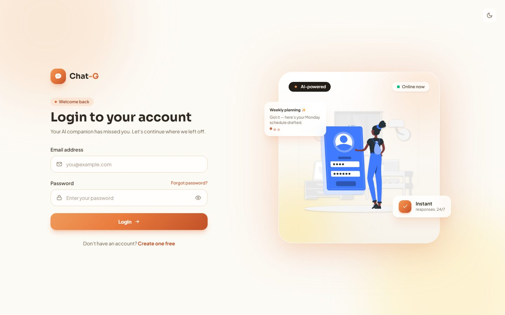
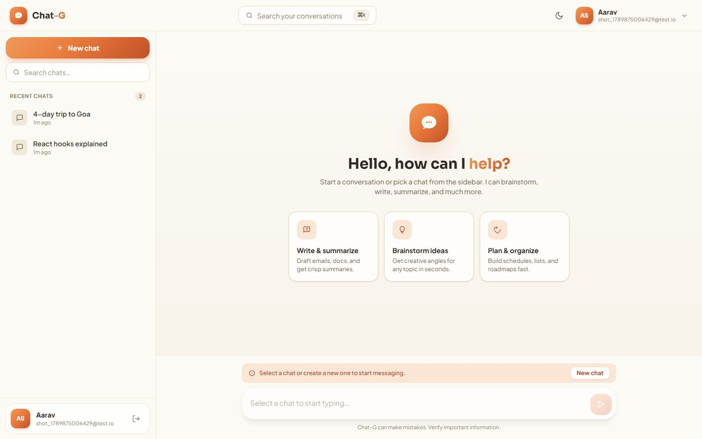
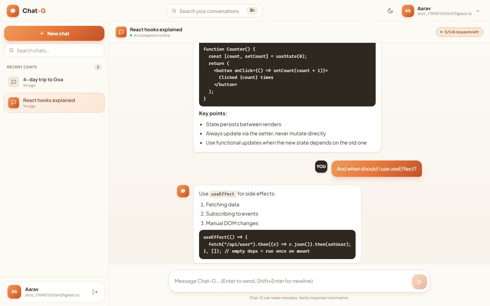
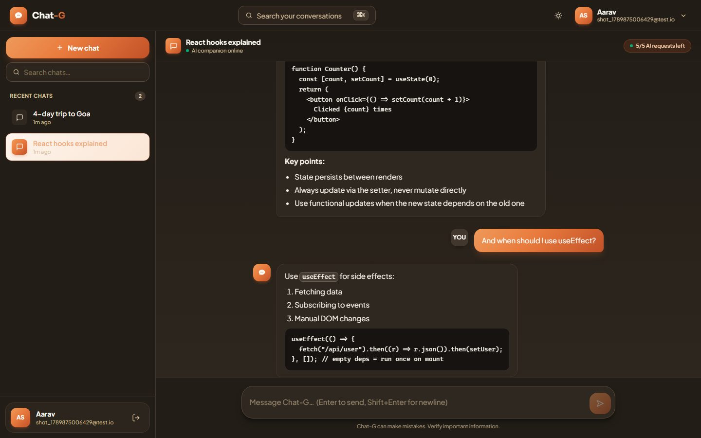
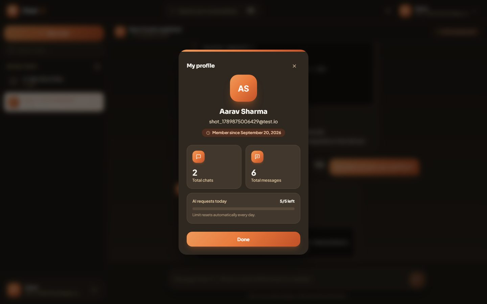
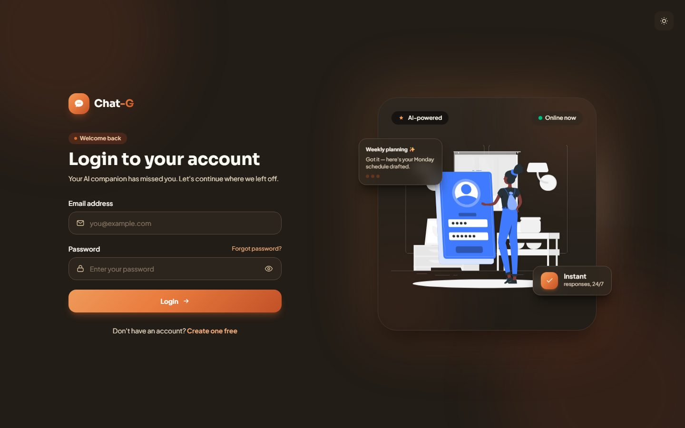

<div align="center">

# 🤖 Chat-G

### A modern, AI-powered real-time chat application

Build fast, beautiful conversations with an LLM companion — streaming replies over WebSockets, per-user daily quotas, a polished theme-aware UI, and a professional three-tier architecture.

[](https://react.dev)
[](https://vite.dev)
[](https://tailwindcss.com)
[](https://nodejs.org)
[](https://expressjs.com)
[](https://socket.io)
[](https://www.mongodb.com)
[](https://groq.com)
[](#-license)

</div>

---

## 📸 Screenshots

| Login — Light | Main workspace — Light |
|---|---|
|  |  |

| Chat conversation — Light | Chat conversation — Dark |
|---|---|
|  |  |

| User profile — Dark | Login — Dark |
|---|---|
|  |  |

_More:_ [Register](screenshots/register-light.jpg) · [Profile light](screenshots/profile-light.jpg)

---

## ✨ Features

- **🔐 Auth & sessions** — Register / login / logout with JWT in an HTTP-only cookie, automatic session restore.
- **💬 Real-time chat** — WebSocket-powered messaging with Markdown + fenced-code rendering and one-click copy.
- **🧠 LLM integration** — Groq as the primary AI runtime, OpenAI as automatic fallback.
- **🛡️ Per-user daily quota** — `AI_DAILY_REQUEST_LIMIT` (default **50**) AI requests per day, **auto-reset at midnight**, database-backed counters with a live remaining-requests chip and profile progress bar.
- **🎭 Polished UI** — Custom cream/clay/ink design system, light & dark themes with no flash-of-wrong-theme, floating-glass showcases, skeleton loaders, toast notifications, micro-animations.
- **📊 Profile analytics** — Total chats, total messages, and daily AI quota usage in a modal.
- **📱 Fully responsive** — Mobile drawer sidebar, adaptive layouts.

---

## 🧱 Tech Stack

| Layer | Technology |
|---|---|
| Frontend | React 19 · Vite 7 · Tailwind CSS v4 · TanStack Query 5 · React Router 7 · Axios · socket.io-client · React Markdown · React Hook Form · React Toastify |
| Backend | Node.js 22 · Express 5 · Socket.IO 4 · Mongoose 9 · JSON Web Tokens · bcryptjs · Zod · LangChain (Groq + OpenAI) |
| Database | MongoDB Atlas |
| Dev tooling | ESLint 9 · Vite HMR · dotenv |

---

## 📁 Project Structure

```
chat_G/
├── backend/
│   ├── src/
│   │   ├── config/          # DB + socket config
│   │   ├── controllers/     # auth, chat, profile, authMe
│   │   ├── middleware/      # authUser (JWT guard)
│   │   ├── models/          # User, Chat, Message
│   │   ├── routes/          # /api/v1 REST routes
│   │   ├── services/        # ai.service (Groq/OpenAI)
│   │   ├── sockets/         # socket.server (ai-message flow)
│   │   ├── tools/           # AI tools
│   │   ├── utils/           # requestLimit.util (daily quota)
│   │   └── validation/      # zod schemas
│   ├── .env.example         # copy → .env
│   └── server.js
└── frontend/
    ├── src/
    │   ├── auth/            # Login, Register, auth hooks
    │   ├── main/            # Chat workspace (Navbar, Sidebar, ChatArea)
    │   ├── shared/          # apiInstance, socket, theme, toasts
    │   └── router/          # route guards (AuthProtect / MainProtect)
    ├── index.html
    └── package.json
```

---

## 🚀 Getting Started

### Prerequisites

- **Node.js ≥ 22**
- **MongoDB Atlas** cluster (free tier) — get the connection string from Atlas
- An **AI provider key**: [Groq](https://console.groq.com/keys) (recommended) or [OpenAI](https://platform.openai.com/api-keys)

### 1. Backend

```bash
cd backend
cp .env.example .env      # then edit .env with your values

npm install
npm start                 # API → http://localhost:3000
```

### 2. Frontend

```bash
cd ../frontend
cp .env.example .env     # optional — point VITE_API_URL at your backend
npm install

npm run dev               # UI → http://localhost:5173
```

Done — open **http://localhost:5173**, register an account, and start chatting! 🎉

Done — open **http://localhost:5173**, register an account, and start chatting! 🎉

> **CORS note:** keep `FRONTEND_URL` in `backend/.env` pointing to your Vite origin (`http://localhost:5173`).
> If you change the daily AI quota, restart the backend.

---

## 🔐 Environment Variables (`backend/.env`)

| Variable | Required | Description |
|---|---|---|
| `PORT` | ✅ | Express server port (default `3000`) |
| `MONGODB_URI` | ✅ | MongoDB connection string |
| `JWT_SECRET` | ✅ | Secret used to sign session tokens |
| `FRONTEND_URL` | ✅ | Allowed CORS origin (frontend URL) |
| `GROQ_API_KEY` | ✅ | Primary LLM provider key |
| `OPENAI_API_KEY` | ⭕ | Fallback LLM provider key |
| `AI_DAILY_REQUEST_LIMIT` | ⭕ | Daily AI requests per user (default `50`) |
| `NODE_ENV` | ⭕ | `development` / `production` |

### Frontend (`frontend/.env`)

| Variable | Required | Description |
|---|---|---|
| `VITE_API_URL` | ✅ | Backend base URL (REST **and** WebSocket). Defaults to `http://localhost:3000` when not set. |

### Deploying

- **Backend (Render):** set `PORT`, `MONGODB_URI`, `JWT_SECRET`, `GROQ_API_KEY` (and `OPENAI_API_KEY`) as Render environment variables.
- **CORS:** set `FRONTEND_URL` on Render to your frontend's exact origin (e.g. `https://your-frontend.vercel.app`). It defaults to `http://localhost:5173` — required for the WebSocket handshake too.
- **Auth:** the app supports two auth transports — the JWT **cookie** (same-origin) and `Authorization: Bearer <token>` (cross-origin). Login returns the token in `data.token`; the frontend stores it and attaches it to every request and the socket handshake, so a frontend hosted on a different domain works out of the box.
- **Frontend (Vercel/Netlify/Render):** set `VITE_API_URL` to the deployed backend URL (e.g. `https://chat-g-qjt1.onrender.com`).

---

## 🔌 API Reference

All endpoints are prefixed with `/api/v1`. Protected routes require the JWT cookie.

| Method | Endpoint | Auth | Description |
|---|---|---|---|
| `POST` | `/auth/register` | — | Create account |
| `POST` | `/auth/login` | — | Login (sets JWT cookie **and** returns `data.token` for cross-origin use) |
| `POST` | `/auth/logout` | ✅ | Logout |
| `GET` | `/authme` | ✅ | Current user (session restore) |
| `POST` | `/chat` | ✅ | Create a chat |
| `GET` | `/chat/getchatHistory` | ✅ | List user chats |
| `GET` | `/chat/getSingalChat/:chatId` | ✅ | Chat message history |
| `GET` | `/profile` | ✅ | Profile + usage stats + quota |

### Socket events

| Event | Direction | Description |
|---|---|---|
| `ai-message` | Client → Server | Send a message for AI processing |
| `ai-response` | Server → Client | AI reply (markdown) |
| `ai-remaining` | Server → Client | Quota remaining after request |
| `ai-limit` | Server → Client | Daily quota exhausted (generation blocked) |

---

## 📄 Documentation

- **SRS** (Software Requirements Specification) — [`SRS.md`](./SRS.md) — IEEE 830 / ISO 29148 format, complete functional + non-functional requirements with a traceability matrix.
- **HTML Requirements Doc** — open [`requirements.html`](./requirements.html) in a browser (theme-aware, scroll-spy nav).

---

## 🗺️ Roadmap

- [ ] Token-by-token streaming (ChatGPT-style typewriter)
- [ ] Regenerate / Stop-generation controls
- [ ] Auto-generated chat titles
- [ ] Chat rename / delete / pin
- [ ] Multi-model & persona picker (Creative / Balanced / Precise)
- [ ] Chat export (Markdown) & full-text search
- [ ] Google OAuth + forgot-password
- [ ] Usage analytics dashboard
- [ ] Refresh-token rotation + HTTP rate limiting + Helmet
- [ ] PWA, Docker, and automated test suite

---

## 📄 License

Distributed under the **MIT License**. See `LICENSE` for more information.

<p align="center">Made with 🧡 — Chat-G</p>